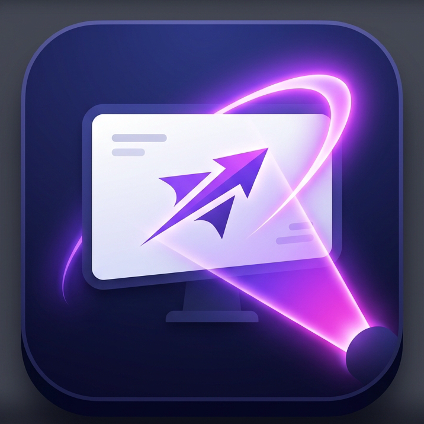

# ApexPresenter

**ApexPresenter** is a world-class, high-performance PDF presentation tool built specifically for remote educators, trainers, and presenters. Designed from the ground up for screen-sharing environments like Google Meet, Zoom, and Microsoft Teams, it ensures that your audience sees exactly what you intend them to see.



## 🚀 Features

*   **Remote-First Design:** An auto-hiding UI and compression-aware contrast boosting ensures that your slides look crisp and your tools stay out of the way on the student's screen.
*   **Dynamic Laser Pointer & Spotlight:** Draw attention instantly. Use the smooth-trailing laser pointer or dim the rest of the screen with a focused spotlight to highlight specific content.
*   **Live Annotations:** Draw, highlight, and add shapes or text directly on top of your PDF slides. All annotations are saved per-slide.
*   **Media Slides:** Seamlessly insert YouTube, Vimeo, Google Drive, or direct MP4 video links as standalone slides without breaking your flow.
*   **Picture-in-Picture Popups:** Open secondary slides or reference materials in draggable, resizable floating windows over your main presentation.
*   **Pre-flight Checklist:** A built-in readiness check ensures you aren't accidentally sharing audio, notifications, or the wrong screen before you begin.
*   **Session Management:** Your presentations, annotations, and settings are auto-saved locally using IndexedDB. Export sessions as `.pdfpro` files or export fully annotated PDFs for your students.

## 🛠️ Technology Stack

*   **Frontend:** [React 19](https://react.dev/) + [Vite](https://vitejs.dev/)
*   **Language:** [TypeScript](https://www.typescriptlang.org/)
*   **Desktop Container:** [Electron](https://www.electronjs.org/)
*   **State Management:** [Zustand](https://github.com/pmndrs/zustand)
*   **PDF Rendering:** `pdfjs-dist` (Hardware-accelerated)
*   **Annotation Engine:** `fabric.js`
*   **Styling:** [Tailwind CSS](https://tailwindcss.com/)

## 💻 Getting Started

### Prerequisites
*   [Node.js](https://nodejs.org/) (v18 or higher recommended)
*   npm (or yarn/pnpm)

### Installation

1.  Clone the repository:
    ```bash
    git clone https://github.com/boddusaiganesh/pdf_presenter.git
    cd pdf_presenter
    ```

2.  Install dependencies:
    ```bash
    npm install
    ```

### Development

To run the application in a standard web browser for fast UI development:
```bash
npm run dev
```

To run the application inside the native Electron desktop container:
```bash
npm run electron:start
```

### Building for Production

To build the executable installer for **Windows**:
```bash
npm run electron:pack:win
```

To build the application for **macOS**:
```bash
npm run electron:pack:mac
```

To build for all supported platforms:
```bash
npm run electron:pack:all
```

The compiled installers and binaries will be available in the `release/` directory.

## 📄 License

This project is proprietary and intended for desktop usage.
